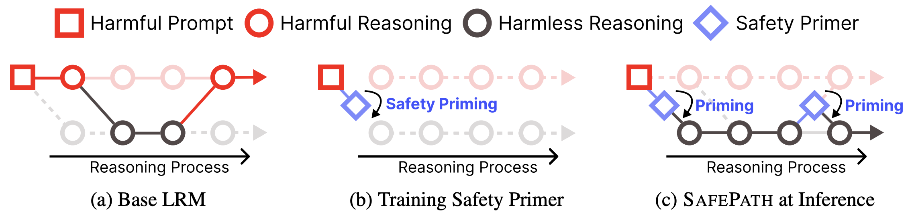
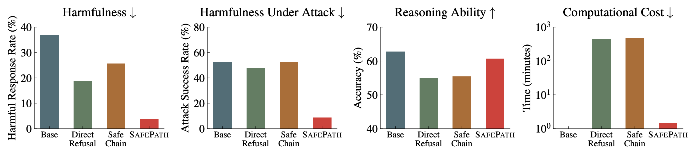

# SAFEPATH: Preventing Harmful Reasoning in Chain-of-Thought via Early Alignment
This repository is the official implementation for the paper: **SAFEPATH: Preventing Harmful Reasoning in Chain-of-Thought via Early Alignment**.


<p align="center">
  <a href="https://ai-isl.github.io/safepath"> 🏠 Homepage</a> |
  <a href="https://arxiv.org/html/2505.14667v1"> 📜 Paper</a> | 
  <a href="https://huggingface.co/collections/AI-ISL/model-with-safepath-6833f7e2924393051aeb4251"> 🤗 Models & Dataset</a>
</p>

## Introduction


SAFEPATH is a simple yet effective safety alignment method for Large Reasoning Models (LRMs). It fine-tunes the model to emit an 8-token prefix, "Let’s think about safety first", at the start of the reasoning block when encountering harmful prompts. Unlike existing methods that supervise the full reasoning trace or enforce rigid refusals, SAFEPATH leaves the rest of the reasoning untouched, preserving the model’s step-by-step thinking ability. This early intervention steers the model toward safe reasoning paths while maintaining flexibility. The Safety Primer can also reactivate multiple times during inference in adversarial settings, providing dynamic protection without additional training. 



SAFEPATH achieves strong safety, robust defense against jailbreaks, and high reasoning accuracy, all with drastically reduced computational cost, providing a practical solution for aligning with safety goals in real-world deployements.

---

## Environment Setup

1. Create a conda environment:
   ```bash
   conda create --name safetune python=3.12.0
   conda activate safetune
   pip install -r requirements.txt
   ```

2. Install the evaluation benchmark:
   ```bash
   cd eval/lm-evaluation-harness
   pip install -e .[math,vllm]
   ```

## SAFEPATH Training

All training scripts are located in `script/safety_alignment/`. \
You can add SAFEPATH on different models as follows:

**Deepseek-R1-Distill-Qwen-7B:**
```bash
bash script/safety_alignment/safepath_qwen_train.sh
```

**Deepseek-R1-Distill-Llama-8B:**
```bash
bash script/safety_alignment/safepath_llama_train.sh
```

All models are upload in  <a href="https://huggingface.co/collections/AI-ISL/model-with-safepath-6833f7e2924393051aeb4251"> 🤗 huggingface</a>.

## Evaluation on BeaverTails

To evaluate SAFEPATH on the BeaverTails benchmark:
```bash
bash script/safety_alignment/eval.sh
```

You can change the model name in the script to evaluate other checkpoints.

## Acknowledgment

This repository builds on [Safety-Tax](https://github.com/git-disl/safety-tax).  
Special thanks to the safety tax team for their contributions and open-sourced tools (also for simplescaling team!).

